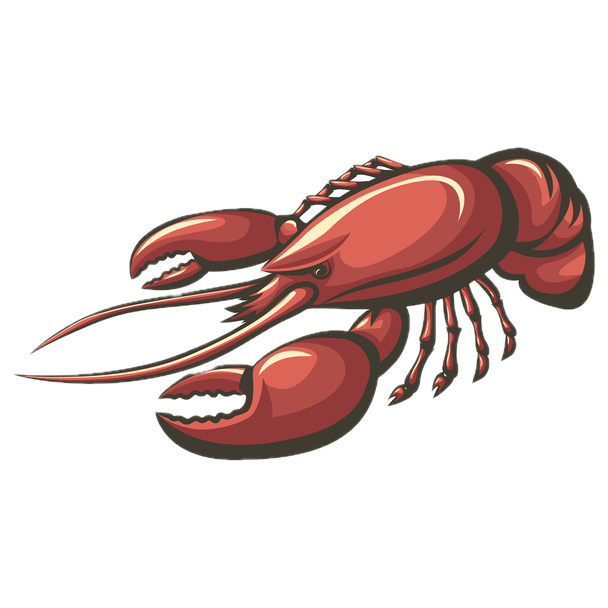

<div align="center">
  
  <h1>crawfish</h1>
  <p>simple programming language</p>
</div>

## Installation (building from source)

**Requirements**

- [Rust Compiler](https://gcc.gnu.org/)
- [GNU Make](https://www.gnu.org/software/make/)

**Steps**

1. Git clone the repository

```sh
git clone https://github.com/simontran9/crawfish.git
```

2. `cd` into the `crawfish/` directory, then build the project with zig's build system

```sh
cd crawfish/
make
```

4. Move the `build/crawfish` compiler binary to a desired location (e.g. in `/Users/<your name>`), then add it to your `PATH` by adding the following line to your `.bashrc` file

```sh
# in your .bashrc
export PATH=$PATH:<path to the crawfish compiler executable>
```

## Usage

- Language tour: Read `docs/language_tour.md`
- Compiler benchmarks: `docs/benchmarks.md`
- Design: `docs/design.md`

## Credits

Many thanks to the creators of the resources that I used.