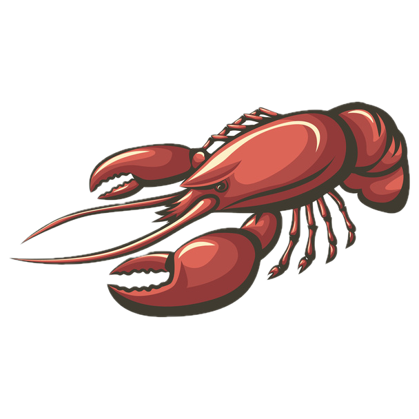

<div align="center">
  
  <h1>crawfish</h1>
  <p>simple programming language</p>
</div>

## Installation (building from source)

### Requirements

[Clang C Compiler](https://clang.llvm.org/)  
[GNU Make](https://www.gnu.org/software/make/)

### Steps

1. Git clone the repository

```shell
git clone https://github.com/simontran9/crawfish.git
```

2. `cd` into the `crawfish/` directory, then build the project with `make`

```shell
cd crawfish/
make
```

4. Add the `build/crawfish` compiler executable to your `PATH` by adding the following line to your `.bashrc` file

```shell
export PATH=$PATH:<path to the crawfish compiler executable>
```

## Usage

Read `doc/language_tour.md` for a tour of the language and its features, `doc/benchmarks.md` for the compiler benchmarks, `doc/design.md` for compiler or language design details.

## Credits

Many thanks to the creators of the resources that I used.